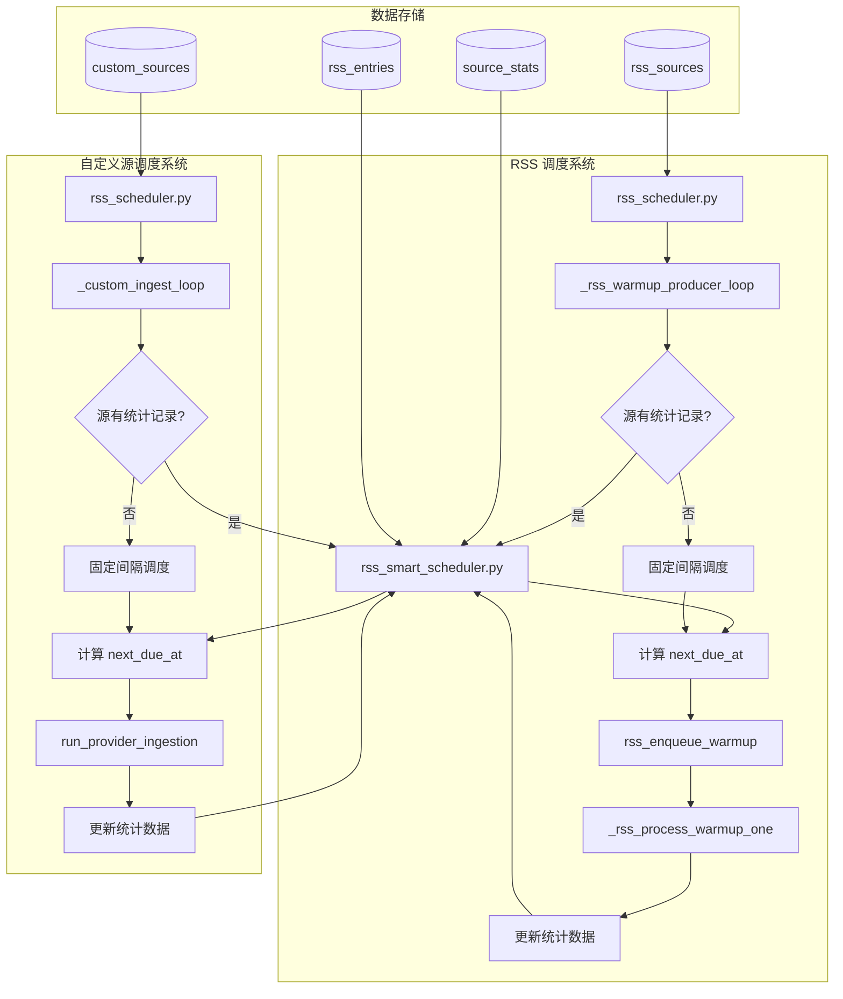

# 设计文档

## 概述

RSS 智能调度器是一个独立的服务模块，负责基于历史更新模式为 RSS 源和自定义源提供智能调度决策。该设计参考已实现的微信公众号智能调度器（`wechat_smart_scheduler.py`），采用相似的架构模式，确保代码一致性和可维护性。

**改造范围：**
- ✅ RSS 源（`rss_sources` 表）
- ✅ 自定义源（`custom_sources` 表）
- ❌ 热源/NewsNow 平台 - 保持现状

核心设计原则：
1. **独立服务模块**：作为 `hotnews/kernel/services/rss_smart_scheduler.py` 实现，不修改现有调度器核心逻辑
2. **渐进式迁移**：新源自动使用智能调度，现有源保持手动节奏直到收集足够数据
3. **兼容性优先**：保持 P0-P6 节奏命名，与现有系统无缝集成
4. **统计驱动**：所有调度决策基于可量化的历史数据
5. **统一管理**：RSS 源和自定义源使用同一套统计表和调度逻辑

## 架构



## 组件和接口

### 1. 数据库表：source_stats

```sql
CREATE TABLE IF NOT EXISTS source_stats (
    source_id TEXT PRIMARY KEY,
    source_type TEXT NOT NULL DEFAULT 'rss',  -- 'rss' 或 'custom'
    
    -- 更新频率分类
    frequency_type TEXT DEFAULT 'daily',
    cadence TEXT DEFAULT 'P2',
    
    -- 发布时间统计（用于预测）
    avg_publish_hour REAL,
    std_publish_hour REAL,
    
    -- 调度状态
    next_due_at INTEGER DEFAULT 0,
    last_check_at INTEGER DEFAULT 0,
    last_article_at INTEGER DEFAULT 0,
    
    -- 失败处理
    fail_count INTEGER DEFAULT 0,
    backoff_until INTEGER DEFAULT 0,
    last_error TEXT,
    
    -- 统计数据
    check_count INTEGER DEFAULT 0,
    hit_count INTEGER DEFAULT 0,
    
    created_at INTEGER,
    updated_at INTEGER
);

CREATE INDEX IF NOT EXISTS idx_source_stats_next_due ON source_stats(next_due_at);
CREATE INDEX IF NOT EXISTS idx_source_stats_cadence ON source_stats(cadence);
CREATE INDEX IF NOT EXISTS idx_source_stats_type ON source_stats(source_type);
CREATE INDEX IF NOT EXISTS idx_source_stats_type_due ON source_stats(source_type, next_due_at);
```

### 2. 智能调度器服务：rss_smart_scheduler.py

#### 节奏配置

```python
# RSS 节奏等级（保持与现有 P0-P6 兼容）
RSS_CADENCE_INTERVALS = {
    "P0": 15 * 60,       # 15分钟 - 实时新闻源
    "P1": 30 * 60,       # 30分钟 - 高频更新
    "P2": 60 * 60,       # 1小时 - 日更（默认）
    "P3": 2 * 60 * 60,   # 2小时 - 固定时间日更
    "P4": 4 * 60 * 60,   # 4小时 - 周更源
    "P5": 8 * 60 * 60,   # 8小时 - 月更源
    "P6": 24 * 60 * 60,  # 24小时 - 低频源
}

# 频率类型到节奏的映射
FREQUENCY_CADENCE_MAP = {
    "realtime": "P0",
    "high": "P1",
    "daily": "P2",
    "daily_fixed": "P3",
    "weekly": "P4",
    "monthly": "P5",
    "low": "P6",
}
```

#### 核心函数接口

```python
def classify_update_frequency(entries: List[Dict[str, Any]]) -> Tuple[str, str]:
    """
    基于历史条目分类更新频率。
    
    Args:
        entries: 条目列表，包含 'published_at' 字段，按时间降序排列
        
    Returns:
        (frequency_type, cadence) 元组
    """

def calculate_publish_time_stats(entries: List[Dict[str, Any]]) -> Tuple[Optional[float], Optional[float]]:
    """
    计算平均发布小时和标准差。
    
    Args:
        entries: 条目列表，包含 'published_at' 字段
        
    Returns:
        (avg_hour, std_hour) 元组，数据不足时返回 (None, None)
    """

def calculate_next_check_time(
    cadence: str,
    frequency_type: str = "daily",
    avg_publish_hour: Optional[float] = None,
    std_publish_hour: Optional[float] = None,
    last_article_at: int = 0,
) -> int:
    """
    基于频率和发布模式计算下次检查时间。
    
    策略：
    1. 对于有规律模式的源，在预测发布时间后检查
    2. 对于不规律的源，使用固定间隔加抖动
    3. 最大等待时间为 24 小时
    
    Returns:
        下次检查的时间戳
    """

def calculate_backoff(fail_count: int, error_message: str = "") -> int:
    """
    计算失败后的退避时间。
    
    Args:
        fail_count: 连续失败次数
        error_message: 错误信息用于分类
        
    Returns:
        退避时长（秒）
    """

def get_source_stats(conn, source_id: str) -> Optional[Dict[str, Any]]:
    """获取指定源的统计数据。"""

def get_recent_entries(conn, source_id: str, source_type: str = "rss", limit: int = 30) -> List[Dict[str, Any]]:
    """获取最近的条目用于频率分析。
    
    Args:
        conn: 数据库连接
        source_id: 源 ID
        source_type: 源类型 ('rss' 或 'custom')
        limit: 最大返回数量
    """

def update_source_stats(
    conn,
    source_id: str,
    source_type: str = "rss",
    has_new_entries: bool = False,
    error_message: str = "",
) -> Dict[str, Any]:
    """
    抓取尝试后更新源统计数据。
    
    Args:
        conn: 数据库连接
        source_id: 源 ID
        source_type: 源类型 ('rss' 或 'custom')
        has_new_entries: 是否发现新条目
        error_message: 错误信息（如果抓取失败）
        
    Returns:
        更新后的统计数据字典
    """

def get_due_sources(conn, now: int, source_type: str = None, limit: int = 20) -> List[Dict[str, Any]]:
    """
    获取到期需要检查的源。
    
    Args:
        conn: 数据库连接
        now: 当前时间戳
        source_type: 源类型过滤 ('rss', 'custom', 或 None 表示全部)
        limit: 最大返回数量
        
    Returns:
        到期源列表
    """

def get_scheduler_stats(conn, source_type: str = None) -> Dict[str, Any]:
    """获取整体调度器统计信息。
    
    Args:
        conn: 数据库连接
        source_type: 源类型过滤 ('rss', 'custom', 或 None 表示全部)
    """
```

### 3. 集成点：rss_scheduler.py 修改

#### 修改 _rss_warmup_producer_loop

```python
async def _rss_warmup_producer_loop() -> None:
    # ... 现有代码 ...
    
    # 新增：优先使用智能调度器的到期源
    from hotnews.kernel.services.rss_smart_scheduler import get_due_sources
    
    smart_due = get_due_sources(conn, now, source_type="rss", limit=10)
    for src in smart_due:
        sid = src.get("source_id", "").strip()
        if sid:
            await rss_enqueue_warmup(sid, priority=10)
    
    # 保留现有逻辑作为后备
    # ...
```

#### 修改 _rss_process_warmup_one

```python
async def _rss_process_warmup_one(source_id: str) -> Dict[str, Any]:
    # ... 现有抓取逻辑 ...
    
    # 新增：更新智能调度统计
    from hotnews.kernel.services.rss_smart_scheduler import update_source_stats
    
    if fetch_success:
        stats = update_source_stats(conn, sid, source_type="rss", has_new_entries=has_new, error_message="")
        next_due = stats.get("next_due_at", 0)
    else:
        stats = update_source_stats(conn, sid, source_type="rss", has_new_entries=False, error_message=error_reason)
        next_due = stats.get("next_due_at", 0)
    
    # 使用智能调度器计算的 next_due_at
    if next_due > 0:
        conn.execute("UPDATE rss_sources SET next_due_at = ? WHERE id = ?", (next_due, sid))
    
    # ...
```

#### 修改 _custom_ingest_loop

```python
async def _custom_ingest_loop() -> None:
    # ... 现有代码 ...
    
    # 新增：优先使用智能调度器的到期源
    from hotnews.kernel.services.rss_smart_scheduler import get_due_sources, update_source_stats
    
    smart_due = get_due_sources(conn, now_ts, source_type="custom", limit=10)
    
    for src in smart_due:
        source_id = src.get("source_id", "").strip()
        if not source_id:
            continue
        
        # 执行抓取...
        # result = await run_provider_ingestion(...)
        
        # 更新统计
        has_new = result.get("new_entries", 0) > 0
        error_msg = result.get("error", "")
        stats = update_source_stats(conn, source_id, source_type="custom", 
                                    has_new_entries=has_new, error_message=error_msg)
        
        # 更新 custom_sources 表的 next_due_at
        next_due = stats.get("next_due_at", 0)
        if next_due > 0:
            conn.execute("UPDATE custom_sources SET next_due_at = ? WHERE id = ?", (next_due, source_id))
    
    # 保留现有逻辑作为后备
    # ...
```

## 数据模型

### 频率分类阈值

| 频率类型 | 平均间隔（小时） | 每日发布数 | 节奏 | 间隔 |
|---------|----------------|-----------|------|------|
| realtime | < 6 | ≥ 5 | P0 | 15分钟 |
| high | 6-18 | - | P1 | 30分钟 |
| daily | 18-36 | - | P2 | 1小时 |
| daily_fixed | 36-72 | - | P3 | 2小时 |
| weekly | 72-168 | - | P4 | 4小时 |
| monthly | 168-720 | - | P5 | 8小时 |
| low | > 720 | - | P6 | 24小时 |

### 退避策略

| 错误类型 | 关键词 | 退避时间 |
|---------|-------|---------|
| 速率限制 | 429, rate, 频繁 | 6小时 |
| 认证过期 | 401, expired, 过期 | 0（不退避） |
| 禁止访问 | 403, forbidden | 12小时 |
| 其他错误 | - | 指数退避，最大24小时 |


## 正确性属性

*正确性属性是一种应该在系统所有有效执行中保持为真的特征或行为——本质上是关于系统应该做什么的形式化陈述。属性作为人类可读规范和机器可验证正确性保证之间的桥梁。*

### Property 1: 频率分类一致性

*对于任何* 有效的 RSS 条目列表（至少 3 条），分类函数返回的频率类型和节奏应该与计算的平均间隔一致：
- 平均间隔 < 6 小时或每日 ≥ 5 条 → realtime/P0
- 6 ≤ 平均间隔 < 18 小时 → high/P1
- 18 ≤ 平均间隔 < 36 小时 → daily/P2
- 36 ≤ 平均间隔 < 72 小时 → daily_fixed/P3
- 72 ≤ 平均间隔 < 168 小时 → weekly/P4
- 168 ≤ 平均间隔 < 720 小时 → monthly/P5
- 平均间隔 ≥ 720 小时 → low/P6

**Validates: Requirements 2.2, 2.3, 2.4, 2.5, 2.6, 2.7, 2.8**

### Property 2: 发布时间统计正确性

*对于任何* 有效的 RSS 条目列表（至少 3 条，每条包含有效的 published_at 时间戳），计算的平均发布小时应该等于所有条目发布小时的算术平均值，标准差应该在 1.0 到 6.0 的范围内。

**Validates: Requirements 3.1, 3.2, 3.3**

### Property 3: 统计计数器递增正确性

*对于任何* 源的更新操作：
- 每次调用 update_source_stats 后，check_count 应该递增 1
- 当 has_new_entries=True 时，hit_count 应该递增 1
- 当 has_new_entries=False 时，hit_count 应该保持不变

**Validates: Requirements 4.1, 4.2**

### Property 4: 命中率计算正确性

*对于任何* 有效的统计数据（check_count > 0），命中率应该等于 hit_count / check_count，结果在 0.0 到 1.0 之间。

**Validates: Requirements 4.3, 4.4**

### Property 5: 下次检查时间边界约束

*对于任何* 输入参数组合，calculate_next_check_time 返回的时间应该满足：
- 不超过当前时间 + 24 小时
- 不超过当前时间 + 基础间隔 × 2
- 大于当前时间

**Validates: Requirements 6.4, 6.6**

### Property 6: 抖动范围约束

*对于任何* 使用固定间隔策略的计算，实际间隔应该在基础间隔的 0.85 到 1.15 倍之间。

**Validates: Requirements 6.5**

### Property 7: 退避时间计算正确性

*对于任何* 错误信息和失败次数：
- 包含 "429"/"rate"/"频繁" → 退避 6 小时
- 包含 "401"/"expired"/"过期" → 退避 0
- 包含 "403"/"forbidden" → 退避 12 小时
- 其他错误 → 指数退避 15min × 2^(fail_count-1)，最大 24 小时

**Validates: Requirements 7.1, 7.2, 7.3, 7.4**

### Property 8: 成功抓取重置状态

*对于任何* 成功的抓取操作（error_message 为空），更新后的统计数据应该满足：
- fail_count = 0
- backoff_until = 0

**Validates: Requirements 7.5**

### Property 9: 节奏兼容性

*对于任何* 分类或更新操作，返回的节奏值应该始终在 {"P0", "P1", "P2", "P3", "P4", "P5", "P6"} 集合中。

**Validates: Requirements 5.4**

### Property 10: 重分析触发条件

*对于任何* 更新操作：
- 当 check_count % 10 == 0 时，应该触发重分析
- 当 has_new_entries=True 且 check_count <= 3 时，应该触发重分析

**Validates: Requirements 5.1, 5.2**

### Property 11: 统计记录创建

*对于任何* 首次更新的源（统计记录不存在），update_source_stats 应该创建新记录，包含所有必需字段。

**Validates: Requirements 1.2**

### Property 12: 时间戳更新

*对于任何* 更新操作，updated_at 字段应该被设置为当前时间戳。

**Validates: Requirements 1.3**

## 错误处理

### 数据库错误

1. **连接失败**：记录错误日志，返回默认值（如默认节奏 P2）
2. **查询失败**：记录错误日志，使用后备逻辑
3. **写入失败**：回滚事务，记录错误日志

### 数据异常

1. **无效时间戳**：跳过该条目，继续处理其他条目
2. **空条目列表**：返回默认频率类型和节奏
3. **计算溢出**：使用安全的数学运算，限制结果范围

### 集成错误

1. **智能调度器不可用**：回退到现有固定间隔调度
2. **统计数据损坏**：重新初始化统计记录

## 测试策略

### 单元测试

单元测试用于验证特定示例和边界条件：

1. **频率分类边界测试**
   - 测试恰好在阈值边界的条目列表
   - 测试少于 3 条条目的情况
   - 测试空列表的情况

2. **发布时间统计边界测试**
   - 测试所有条目在同一小时发布的情况
   - 测试跨越午夜的发布时间
   - 测试少于 3 条条目的情况

3. **退避计算边界测试**
   - 测试各种错误关键词组合
   - 测试大量连续失败的情况

### 属性测试

属性测试用于验证通用属性，每个测试至少运行 100 次迭代：

1. **Property 1 测试**：生成随机条目列表，验证分类结果与平均间隔一致
   - **Feature: rss-smart-scheduler, Property 1: 频率分类一致性**

2. **Property 2 测试**：生成随机条目列表，验证统计计算正确性
   - **Feature: rss-smart-scheduler, Property 2: 发布时间统计正确性**

3. **Property 3 测试**：模拟随机更新操作，验证计数器递增
   - **Feature: rss-smart-scheduler, Property 3: 统计计数器递增正确性**

4. **Property 4 测试**：生成随机统计数据，验证命中率计算
   - **Feature: rss-smart-scheduler, Property 4: 命中率计算正确性**

5. **Property 5 测试**：生成随机参数，验证时间边界约束
   - **Feature: rss-smart-scheduler, Property 5: 下次检查时间边界约束**

6. **Property 6 测试**：多次调用固定间隔计算，验证抖动范围
   - **Feature: rss-smart-scheduler, Property 6: 抖动范围约束**

7. **Property 7 测试**：生成随机错误信息，验证退避时间
   - **Feature: rss-smart-scheduler, Property 7: 退避时间计算正确性**

8. **Property 8 测试**：模拟成功抓取，验证状态重置
   - **Feature: rss-smart-scheduler, Property 8: 成功抓取重置状态**

9. **Property 9 测试**：生成随机输入，验证节奏值范围
   - **Feature: rss-smart-scheduler, Property 9: 节奏兼容性**

10. **Property 10 测试**：模拟多次更新，验证重分析触发
    - **Feature: rss-smart-scheduler, Property 10: 重分析触发条件**

11. **Property 11 测试**：模拟首次更新，验证记录创建
    - **Feature: rss-smart-scheduler, Property 11: 统计记录创建**

12. **Property 12 测试**：模拟更新操作，验证时间戳更新
    - **Feature: rss-smart-scheduler, Property 12: 时间戳更新**

### 测试框架配置

- **属性测试库**：使用 `hypothesis` 库进行 Python 属性测试
- **最小迭代次数**：每个属性测试至少 100 次
- **测试标签格式**：`# Feature: rss-smart-scheduler, Property N: {property_text}`

### 集成测试

1. **与现有调度器集成**
   - 验证智能调度器可用时使用智能调度
   - 验证智能调度器不可用时回退到固定间隔

2. **数据库集成**
   - 验证表创建和索引
   - 验证并发更新安全性
