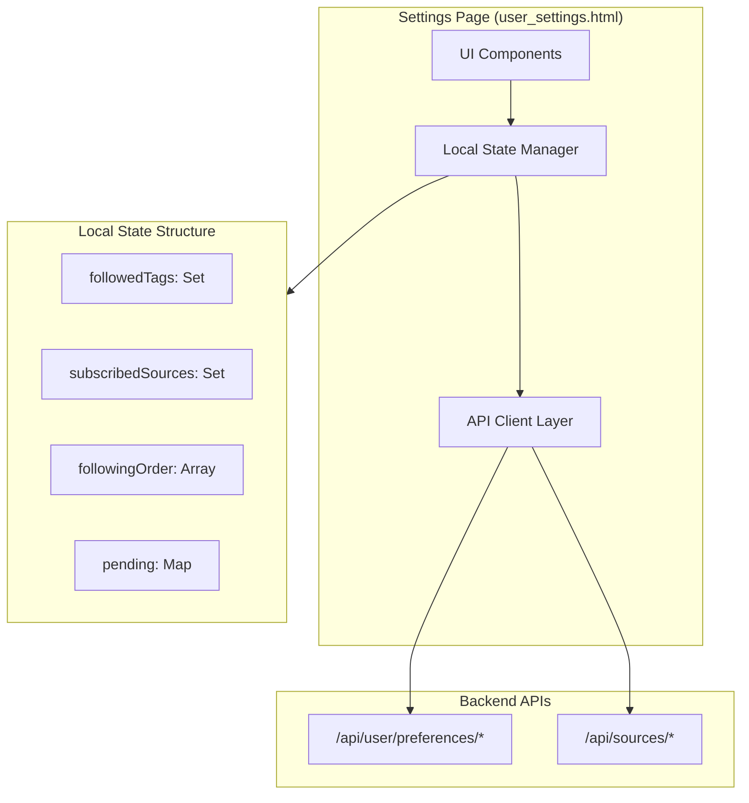

# Design Document: Settings Unified Following

## Overview

This design integrates RSS/custom source subscription into the existing user settings page (`user_settings.html`). The implementation extends the current local state management pattern to handle both tags and sources in a unified following list, adds a tab-based selector UI, and implements source search with subscription management.

The design prioritizes:
- Minimal changes to existing tag management code
- Consistent UX patterns (optimistic updates, drag-to-reorder)
- Reuse of existing CSS variables and styling
- Integration with existing backend APIs

## Architecture



### Data Flow

1. **Initialization**: Page loads → Fetch tags + subscriptions in parallel → Merge into unified local state → Render
2. **Follow/Subscribe**: User action → Optimistic update → API call → Success/Rollback → Cache invalidation
3. **Reorder**: Drag action → Update local order → Re-render → Persist to backend

## Components and Interfaces

### 1. Extended Local State

```javascript
const localState = {
    // Existing tag state
    followed: new Set(),           // Set of followed tag IDs
    tagOrder: [],                  // Array of tag IDs in display order
    
    // New source state
    subscribedSources: new Set(),  // Set of subscribed source IDs
    sourceDetails: new Map(),      // Map of source_id -> {name, type, url}
    
    // Unified following order (mixed tags and sources)
    followingOrder: [],            // Array of {type: 'tag'|'source', id: string}
    
    // Pending operations (extended)
    pending: new Map(),            // id -> {operation, timestamp, itemType}
    
    // UI state
    activeTab: 'tags',             // 'tags' | 'sources'
    sourceSearchQuery: '',
    sourceSearchResults: [],
};
```

### 2. UI Components

#### 2.1 Unified Following List Component

```html
<!-- Following Section -->
<div class="section">
    <h2>💚 已关注 <span class="hint">（拖动调整顺序，点击取消关注）</span></h2>
    <div class="following-list sortable" id="following-list">
        <!-- Rendered items: tags and sources mixed -->
    </div>
</div>
```

#### 2.2 Tab Selector Component

```html
<!-- Add Following Section -->
<div class="section">
    <h2>➕ 添加关注</h2>
    <div class="selector-tabs" id="selector-tabs">
        <button class="tab-btn active" data-tab="tags">🏷️ 标签</button>
        <button class="tab-btn" data-tab="sources">📡 订阅源</button>
    </div>
    <div class="tab-content" id="tab-content">
        <!-- Tag selector or Source selector -->
    </div>
</div>
```

#### 2.3 Source Selector Component

```html
<!-- Source Selector (shown when sources tab active) -->
<div class="source-selector" id="source-selector">
    <input type="text" id="source-search" placeholder="🔍 搜索订阅源..." />
    <div class="source-results" id="source-results">
        <!-- Search results -->
    </div>
</div>
```

### 3. API Interface

```typescript
interface FollowingItem {
    type: 'tag' | 'source';
    id: string;
    name: string;
    icon: string;
}

interface SourceSearchResult {
    id: string;
    type: 'rss' | 'custom';
    name: string;
    url: string;
    category: string;
    is_subscribed: boolean;
}

interface SubscriptionResponse {
    ok: boolean;
    message?: string;
    subscriptions?: SourceSearchResult[];
}
```

### 4. Key Functions

```javascript
// Initialization
async function init() {
    // Existing auth check...
    
    // Load data in parallel (extended)
    const [tagsResp, settingsResp, prefsResp, subscriptionsResp] = await Promise.all([
        fetch('/api/admin/tags/public/all'),
        fetch('/api/user/preferences/tag-settings'),
        fetch('/api/user/preferences/tags'),
        fetch('/api/sources/subscriptions'),  // NEW
    ]);
    
    // Initialize unified state
    syncLocalState(settingsData, subscriptionsData);
    render();
}

// Unified state sync
function syncLocalState(settingsData, subscriptionsData) {
    // Tags (existing)
    localState.followed = new Set((settingsData.followed || []).map(f => f.tag_id));
    localState.tagOrder = (settingsData.followed || []).map(f => f.tag_id);
    
    // Sources (new)
    const subs = subscriptionsData.subscriptions || [];
    localState.subscribedSources = new Set(subs.map(s => s.id));
    subs.forEach(s => localState.sourceDetails.set(s.id, s));
    
    // Build unified order
    buildUnifiedOrder();
}

// Build unified following order
function buildUnifiedOrder() {
    localState.followingOrder = [
        ...localState.tagOrder.map(id => ({ type: 'tag', id })),
        ...[...localState.subscribedSources].map(id => ({ type: 'source', id })),
    ];
}

// Render unified following list
function renderFollowingList() {
    const container = document.getElementById('following-list');
    
    if (localState.followingOrder.length === 0) {
        container.innerHTML = '<div class="empty-state">还没有关注任何内容</div>';
        return;
    }
    
    container.innerHTML = localState.followingOrder.map(item => {
        if (item.type === 'tag') {
            return createFollowedTagChipHTML(getTagById(item.id));
        } else {
            return createSubscribedSourceChipHTML(localState.sourceDetails.get(item.id));
        }
    }).join('');
    
    initSortable();
}

// Source subscription
async function subscribeSource(sourceId, sourceType) {
    if (localState.pending.has(sourceId)) return;
    
    // Optimistic update
    localState.pending.set(sourceId, { operation: 'subscribe', timestamp: Date.now() });
    localState.subscribedSources.add(sourceId);
    buildUnifiedOrder();
    renderFollowingList();
    updateSourceSearchUI(sourceId, true);
    
    try {
        const resp = await fetch('/api/sources/subscribe', {
            method: 'POST',
            headers: { 'Content-Type': 'application/json' },
            body: JSON.stringify({ source_type: sourceType, source_id: sourceId })
        });
        
        if (!resp.ok) throw new Error('Subscribe failed');
        
        localState.pending.delete(sourceId);
        clearRelevantCaches();
        showToast('订阅成功', 'success');
    } catch (error) {
        // Rollback
        localState.pending.delete(sourceId);
        localState.subscribedSources.delete(sourceId);
        buildUnifiedOrder();
        renderFollowingList();
        updateSourceSearchUI(sourceId, false);
        showToast('订阅失败，请重试', 'error');
    }
}

// Source search with debounce
const searchSources = debounce(async (query) => {
    if (query.length < 2) {
        localState.sourceSearchResults = [];
        renderSourceResults();
        return;
    }
    
    try {
        const resp = await fetch(`/api/sources/search?q=${encodeURIComponent(query)}`);
        const data = await resp.json();
        localState.sourceSearchResults = data.sources || [];
        renderSourceResults();
    } catch (error) {
        showToast('搜索失败', 'error');
    }
}, 300);
```

## Data Models

### Frontend State Model

```javascript
// Following item for unified list
{
    type: 'tag' | 'source',
    id: string,
    name: string,
    icon: string,        // 🏷️ for tags, 📰 for RSS, 🔗 for custom
    url?: string,        // Only for sources
    category?: string,   // Only for sources
}

// Source details cache
{
    id: string,
    type: 'rss' | 'custom',
    name: string,
    url: string,
    subscribed_at: number,
}
```

### API Response Models

```javascript
// GET /api/sources/subscriptions response
{
    ok: boolean,
    subscriptions: [{
        id: string,
        type: 'rss' | 'custom',
        name: string,
        url: string,
        subscribed_at: number,
    }]
}

// GET /api/sources/search response
{
    ok: boolean,
    sources: [{
        id: string,
        type: 'rss' | 'custom',
        name: string,
        url: string,
        category: string,
        is_subscribed: boolean,
    }]
}
```

## Correctness Properties

*A property is a characteristic or behavior that should hold true across all valid executions of a system—essentially, a formal statement about what the system should do. Properties serve as the bridge between human-readable specifications and machine-verifiable correctness guarantees.*


Based on the prework analysis, the following properties have been identified and consolidated to eliminate redundancy:

### Property 1: Following List Item Rendering

*For any* item in the following list (tag or source), the rendered HTML SHALL contain both the item's name and the correct type icon (🏷️ for tags, 📰 for RSS sources, 🔗 for custom sources).

**Validates: Requirements 1.2, 1.4**

### Property 2: Click-to-Unfollow Behavior

*For any* item in the following list, when clicked, the item SHALL be removed from the local state (followed set for tags, subscribedSources set for sources) and the corresponding API endpoint SHALL be called.

**Validates: Requirements 1.5, 1.6**

### Property 3: Drag Reorder Optimistic Update

*For any* drag operation moving an item from position A to position B, the local `followingOrder` array SHALL immediately reflect the new order before the API response is received.

**Validates: Requirements 2.2, 2.3**

### Property 4: Drag Reorder Rollback on Failure

*For any* drag operation where the backend persistence fails, the `followingOrder` array SHALL be reverted to its state before the drag operation.

**Validates: Requirements 2.4**

### Property 5: Tab-Content Correspondence

*For any* active tab state ('tags' or 'sources'), the rendered content SHALL match the expected selector component (Tag_Selector for 'tags', Source_Selector for 'sources').

**Validates: Requirements 3.2, 3.3, 3.4**

### Property 6: Search Minimum Character Threshold

*For any* search input with fewer than 2 characters, the search API SHALL NOT be called and the results SHALL be empty.

**Validates: Requirements 4.2**

### Property 7: Search Debounce Behavior

*For any* sequence of rapid search inputs within 300ms, only the final input SHALL trigger an API call.

**Validates: Requirements 4.3**

### Property 8: Search Result Rendering

*For any* source in the search results, the rendered HTML SHALL contain the source name, type icon, and current subscription status indicator.

**Validates: Requirements 4.4**

### Property 9: Subscription Status Button Rendering

*For any* source displayed in the Source_Selector, if `is_subscribed` is false, a "订阅" button SHALL be shown; if `is_subscribed` is true, a "已订阅" indicator SHALL be shown.

**Validates: Requirements 5.1, 5.2**

### Property 10: Subscription Optimistic Update

*For any* subscribe or unsubscribe action, the local state (`subscribedSources` set) SHALL be updated immediately before the API response, and the UI SHALL reflect this change.

**Validates: Requirements 5.3, 5.4, 5.6**

### Property 11: Subscription Rollback on Failure

*For any* subscription action where the API call fails, the local state SHALL be reverted to its previous value and an error message SHALL be displayed.

**Validates: Requirements 5.5**

### Property 12: Count Synchronization

*For any* follow/unfollow or subscribe/unsubscribe action, the displayed counts in the statistics section SHALL equal the size of the corresponding local state sets (`followed.size` for tags, `subscribedSources.size` for sources).

**Validates: Requirements 6.3, 6.4**

### Property 13: Parallel Data Loading

*For any* page initialization, the tag settings API and source subscriptions API SHALL be called concurrently (not sequentially).

**Validates: Requirements 7.1**

### Property 14: Auth Check Before API Calls

*For any* API call made by the Settings_Page, the authentication status SHALL be verified first, and if unauthenticated, a redirect SHALL occur instead of the API call.

**Validates: Requirements 8.2**

### Property 15: Cache Invalidation on Success

*For any* successful tag or source action (follow, unfollow, subscribe, unsubscribe), the relevant frontend caches SHALL be cleared. Cache SHALL NOT be cleared on failed actions.

**Validates: Requirements 9.1, 9.2, 9.3**

## Error Handling

### API Error Handling

| Error Scenario | Handling Strategy |
|----------------|-------------------|
| Auth check fails (401) | Redirect to `/api/auth/page` |
| Tag settings load fails | Show error message with retry button |
| Subscriptions load fails | Show error message with retry button |
| Source search fails | Show "搜索失败" toast, keep previous results |
| Subscribe/Unsubscribe fails | Rollback optimistic update, show "操作失败，请重试" toast |
| Order save fails | Rollback to previous order, show error toast |

### Network Error Handling

```javascript
async function safeApiCall(apiCall, onError) {
    try {
        const response = await apiCall();
        if (!response.ok) {
            throw new Error(`HTTP ${response.status}`);
        }
        return await response.json();
    } catch (error) {
        console.error('API call failed:', error);
        onError?.(error);
        throw error;
    }
}
```

### State Rollback Pattern

```javascript
function withRollback(action, rollback) {
    return async (...args) => {
        const snapshot = captureState();
        try {
            await action(...args);
        } catch (error) {
            restoreState(snapshot);
            rollback?.(error);
        }
    };
}
```

## Testing Strategy

### Unit Tests

Unit tests should focus on specific examples and edge cases:

1. **Empty state rendering**: Verify empty message when no items followed
2. **Tab switching**: Verify correct component renders for each tab
3. **Search edge cases**: Empty query, single character, special characters
4. **Error message display**: Verify error toasts appear on failures
5. **Loading state**: Verify loading indicator during data fetch

### Property-Based Tests

Property tests should use a property-based testing library (e.g., fast-check for JavaScript) with minimum 100 iterations per test.

Each property test should be tagged with:
- **Feature: settings-unified-following, Property {N}: {property_text}**

Property tests to implement:

1. **Property 1 Test**: Generate random following items, verify rendering contains correct icon and name
2. **Property 2 Test**: Generate random items, simulate click, verify state update and API call
3. **Property 3 Test**: Generate random orders and drag operations, verify immediate state update
4. **Property 5 Test**: Generate random tab states, verify content matches
5. **Property 6 Test**: Generate random short strings (<2 chars), verify no API call
6. **Property 8 Test**: Generate random search results, verify rendering contains required fields
7. **Property 9 Test**: Generate random sources with varying subscription status, verify button state
8. **Property 10 Test**: Generate random subscription actions, verify optimistic state update
9. **Property 12 Test**: Generate random action sequences, verify count equals set size

### Integration Tests

1. Full page load with mock API responses
2. Complete subscribe/unsubscribe flow
3. Drag reorder with persistence
4. Tab switching with state preservation
5. Search with debounce verification
