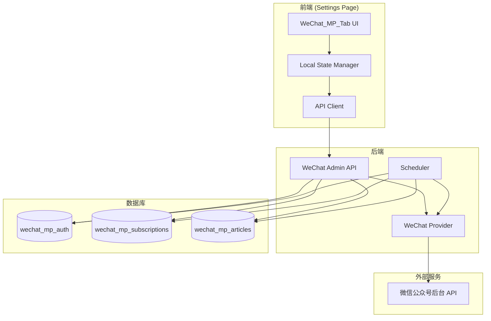

# Design Document: 微信公众号订阅功能

## Overview

本设计在 Hotnews 设置页面新增"公众号"Tab，实现微信公众号订阅功能。用户通过配置自己的微信公众号后台 Cookie/Token，可以搜索并订阅公众号，系统定时抓取文章并展示在首页。

设计原则：
- 用户自助授权模式，每个用户使用自己的公众号账号
- 乐观更新 UI，提供流畅的用户体验
- 共享文章缓存，多用户订阅同一公众号时复用数据
- 完善的错误处理和认证过期提醒机制

## Architecture

### 部署架构

**当前方案：内置抓取（方案 A）**

微信抓取功能作为 Hotnews 主服务的内置模块，简化部署和维护。

```
┌─────────────────────────────────────────────────────────────┐
│                    Hotnews 主服务 (单体)                      │
│  ┌─────────────┐  ┌─────────────┐  ┌─────────────────────┐  │
│  │ Web Server  │  │ Scheduler   │  │ WeChat Provider     │  │
│  │ (FastAPI)   │  │ (asyncio)   │  │ (新增模块)           │  │
│  └─────────────┘  └──────┬──────┘  └──────────┬──────────┘  │
│                          │                     │             │
│                          ▼                     ▼             │
│                   定时任务触发 ──────────► 调用微信 API       │
└─────────────────────────────────────────────────────────────┘
```

**后期可分离设计**

代码结构保持模块边界清晰，后期用户量大时可轻松分离为独立服务：

```
当前（方案 A）                      后期（方案 B）
┌─────────────────────┐            ┌─────────────────────┐
│  Hotnews 主服务      │            │  Hotnews 主服务      │
│  ┌───────────────┐  │            │                     │
│  │WeChatProvider │  │  ──拆分──► │  读取共享数据库      │
│  │(内置模块)      │  │            │                     │
│  └───────────────┘  │            └─────────────────────┘
│         │           │                      ▲
│         ▼           │                      │ 共享 DB
│  wechat_mp_articles │            ┌─────────┴───────────┐
└─────────────────────┘            │  WeChat 抓取服务     │
                                   │  (独立部署)          │
                                   │  写入 wechat_mp_*    │
                                   └─────────────────────┘
```

**分离友好的设计原则：**
- `WeChatMPProvider` 独立文件，可整体迁移
- `wechat_mp_articles` 独立表，可共享数据库
- `/api/wechat/*` 独立路由组，可代理到新服务
- 抓取配置通过环境变量外置

### 组件架构



### 数据流

1. **认证配置**: 用户输入 Cookie/Token → 前端验证格式 → 后端验证有效性 → 保存到数据库
2. **公众号搜索**: 用户输入关键词 → 防抖处理 → 调用微信 API → 返回搜索结果
3. **订阅操作**: 用户点击订阅 → 乐观更新 UI → 调用后端 API → 成功/回滚
4. **文章抓取**: 定时任务触发 → 遍历有效用户 → 获取订阅列表 → 调用微信 API → 存储文章
5. **AI 标签分类**: 新文章入库 → 调用 AI 分类 → 写入 rss_entry_tags（source_id='wechat-{fakeid}'）

### AI 标签集成

微信文章复用现有的 AI 标签分类系统：

```python
# 文章抓取后，生成标签关联的 source_id 和 dedup_key
def store_wechat_article(article: dict, fakeid: str):
    import hashlib
    
    # 生成 dedup_key
    dedup_key = hashlib.md5(article['url'].encode()).hexdigest()
    
    # 存储文章
    conn.execute("""
        INSERT OR IGNORE INTO wechat_mp_articles
        (fakeid, dedup_key, title, url, digest, cover_url, publish_time, fetched_at, mp_nickname)
        VALUES (?, ?, ?, ?, ?, ?, ?, ?, ?)
    """, (fakeid, dedup_key, article['title'], article['url'], ...))
    
    # 调用 AI 分类（复用现有逻辑）
    source_id = f"wechat-{fakeid}"
    ai_classify_entry(source_id=source_id, dedup_key=dedup_key, title=article['title'])

# AI 分类结果写入 rss_entry_tags（现有逻辑无需修改）
def ai_classify_entry(source_id: str, dedup_key: str, title: str):
    # ... 调用 AI 获取标签 ...
    conn.execute("""
        INSERT OR IGNORE INTO rss_entry_tags
        (source_id, dedup_key, tag_id, confidence, source, created_at)
        VALUES (?, ?, ?, ?, 'ai', ?)
    """, (source_id, dedup_key, tag_id, confidence, now))
```

**查询"我的关注"时合并两种来源：**

```python
def get_followed_news_by_tag(user_id: int, tag_id: str):
    # Part 1: RSS 文章
    rss_news = conn.execute("""
        SELECT e.title, e.url, e.published_at, 'rss' as source_type, s.name as source_name
        FROM rss_entries e
        JOIN rss_entry_tags t ON e.source_id = t.source_id AND e.dedup_key = t.dedup_key
        LEFT JOIN rss_sources s ON s.id = e.source_id
        WHERE t.tag_id = ?
    """, (tag_id,)).fetchall()
    
    # Part 2: 微信文章
    wechat_news = conn.execute("""
        SELECT a.title, a.url, a.publish_time as published_at, 'wechat' as source_type, a.mp_nickname as source_name
        FROM wechat_mp_articles a
        JOIN rss_entry_tags t ON t.source_id = 'wechat-' || a.fakeid AND t.dedup_key = a.dedup_key
        WHERE t.tag_id = ?
    """, (tag_id,)).fetchall()
    
    # 合并并按时间排序
    all_news = rss_news + wechat_news
    all_news.sort(key=lambda x: x['published_at'], reverse=True)
    return all_news
```

## Components and Interfaces

### 1. 后端组件

#### 1.1 WeChat Provider (`hotnews/kernel/providers/wechat_provider.py`)

```python
class WeChatMPProvider:
    """微信公众号 Provider，负责与微信 API 交互"""
    
    BASE_URL = "https://mp.weixin.qq.com"
    
    def __init__(self, cookie: str, token: str):
        self.cookie = cookie
        self.token = token
        self.headers = {
            "Cookie": cookie,
            "User-Agent": "Mozilla/5.0 (Windows NT 10.0; Win64; x64) AppleWebKit/537.36",
            "Referer": "https://mp.weixin.qq.com/",
        }
    
    def test_auth(self) -> AuthTestResult:
        """测试认证信息是否有效"""
        pass
    
    def search_mp(self, keyword: str, limit: int = 10) -> SearchResult:
        """搜索公众号
        
        Args:
            keyword: 搜索关键词
            limit: 返回数量限制
            
        Returns:
            SearchResult: 包含公众号列表或错误信息
        """
        pass
    
    def get_articles(self, fakeid: str, count: int = 20) -> ArticlesResult:
        """获取公众号文章列表
        
        Args:
            fakeid: 公众号唯一标识
            count: 获取数量
            
        Returns:
            ArticlesResult: 包含文章列表或错误信息
        """
        pass
```

#### 1.2 WeChat Admin API (`hotnews/kernel/admin/wechat_admin.py`)

```python
# API 端点定义

# 认证管理
POST /api/wechat/auth           # 保存认证信息
GET  /api/wechat/auth/status    # 获取认证状态
POST /api/wechat/auth/test      # 测试认证有效性

# 公众号搜索与订阅
GET  /api/wechat/search         # 搜索公众号 (query: keyword)
POST /api/wechat/subscribe      # 订阅公众号 (body: {fakeid, nickname, ...})
POST /api/wechat/unsubscribe    # 取消订阅 (body: {fakeid})
GET  /api/wechat/subscriptions  # 获取订阅列表

# 文章获取
GET  /api/wechat/articles       # 获取订阅的文章列表
POST /api/wechat/refresh        # 手动刷新文章
```

#### 1.3 Scheduler (`hotnews/kernel/scheduler/wechat_scheduler.py`)

```python
class WeChatArticleScheduler:
    """定时抓取公众号文章的调度器"""
    
    FETCH_INTERVAL = 30 * 60  # 每个公众号 30 分钟抓取一次
    REQUEST_DELAY = 2  # 请求间隔 2 秒
    
    async def run(self):
        """运行定时任务"""
        pass
    
    async def fetch_user_subscriptions(self, user_id: int, auth: AuthInfo):
        """抓取单个用户的所有订阅"""
        pass
    
    async def fetch_mp_articles(self, fakeid: str, auth: AuthInfo) -> List[Article]:
        """抓取单个公众号的文章"""
        pass
```

### 2. 前端组件

#### 2.1 Local State

```javascript
const wechatState = {
    // 认证状态
    auth: {
        status: 'none' | 'valid' | 'expired' | 'invalid',
        expiresAt: null,  // 预估过期时间
        updatedAt: null,  // 最后更新时间
    },
    
    // 订阅列表
    subscriptions: new Map(),  // fakeid -> {nickname, headimg, signature}
    
    // 搜索状态
    search: {
        query: '',
        results: [],
        loading: false,
        error: null,
    },
    
    // 待处理操作
    pending: new Map(),  // fakeid -> {operation, timestamp}
};
```

#### 2.2 UI 组件结构

```html
<!-- 公众号 Tab 内容 -->
<div class="wechat-mp-tab" id="wechat-mp-tab">
    <!-- 认证状态区域 -->
    <div class="section auth-section">
        <h3>📱 微信公众号认证</h3>
        <div class="auth-status" id="auth-status">
            <!-- 动态渲染认证状态 -->
        </div>
    </div>
    
    <!-- 已订阅列表 -->
    <div class="section subscriptions-section">
        <h3>💚 已订阅的公众号</h3>
        <div class="subscription-list" id="subscription-list">
            <!-- 动态渲染订阅列表 -->
        </div>
    </div>
    
    <!-- 搜索区域 -->
    <div class="section search-section">
        <h3>🔍 搜索公众号</h3>
        <input type="text" id="mp-search-input" placeholder="输入公众号名称..." />
        <div class="search-results" id="search-results">
            <!-- 动态渲染搜索结果 -->
        </div>
    </div>
</div>

<!-- 认证配置弹窗 -->
<div class="modal" id="auth-modal">
    <div class="modal-content">
        <h3>配置微信公众号认证</h3>
        <div class="auth-guide">
            <!-- 获取 Cookie/Token 的操作指南 -->
        </div>
        <form id="auth-form">
            <textarea id="cookie-input" placeholder="粘贴 Cookie..."></textarea>
            <input type="text" id="token-input" placeholder="输入 Token..." />
            <button type="submit">验证并保存</button>
        </form>
    </div>
</div>
```

### 3. 接口定义

#### 3.1 API 请求/响应格式

```typescript
// 认证状态响应
interface AuthStatusResponse {
    ok: boolean;
    status: 'none' | 'valid' | 'expired' | 'invalid';
    expires_at?: number;  // Unix timestamp
    updated_at?: number;
}

// 搜索结果响应
interface SearchResponse {
    ok: boolean;
    error?: string;
    error_code?: number;  // 微信错误码
    list: MPAccount[];
}

interface MPAccount {
    fakeid: string;
    nickname: string;
    round_head_img: string;
    signature: string;
    is_subscribed: boolean;
}

// 订阅列表响应
interface SubscriptionsResponse {
    ok: boolean;
    subscriptions: Subscription[];
}

interface Subscription {
    fakeid: string;
    nickname: string;
    round_head_img: string;
    signature: string;
    subscribed_at: number;
}

// 文章列表响应
interface ArticlesResponse {
    ok: boolean;
    articles: Article[];
    total: number;
}

interface Article {
    id: number;
    fakeid: string;
    mp_name: string;
    title: string;
    url: string;
    digest: string;
    cover_url: string;
    publish_time: number;
}
```

## Data Models

### 数据存储策略

**设计决策：微信文章独立存表 + 复用 rss_entry_tags 做标签关联**

理由：
1. **数据来源本质不同**：RSS 是公开订阅，微信需要用户授权，生命周期管理不同
2. **抓取逻辑不同**：RSS 可以无限制抓取，微信有频率限制和 Token 过期问题
3. **扩展性**：微信后续可能添加阅读量、评论等特有字段
4. **风险隔离**：微信功能出问题不会影响 RSS
5. **AI 标签复用**：通过统一的 source_id 格式，复用现有的 `rss_entry_tags` 表

### 与现有系统的集成

```
┌─────────────────────────────────────────────────────────────────┐
│                        rss_entry_tags                           │
│  (source_id, dedup_key, tag_id, confidence, source, created_at) │
└─────────────────────────────────────────────────────────────────┘
           ▲                                    ▲
           │                                    │
           │ source_id = 'rss-{id}'             │ source_id = 'wechat-{fakeid}'
           │ dedup_key = entry.dedup_key        │ dedup_key = md5(url)
           │                                    │
┌──────────┴──────────┐              ┌──────────┴──────────┐
│    rss_entries      │              │  wechat_mp_articles │
│  (现有 RSS 文章表)   │              │   (新增微信文章表)   │
└─────────────────────┘              └─────────────────────┘
```

**source_id 命名规范：**
- RSS 文章：`rss-{source_id}`（如 `rss-123`）
- 微信文章：`wechat-{fakeid}`（如 `wechat-MzI2NDk5NzA0Mw==`）

**dedup_key 生成规则：**
- RSS 文章：使用现有的 dedup_key
- 微信文章：`hashlib.md5(url.encode()).hexdigest()`

### 数据库表设计

```sql
-- 微信公众号认证信息（每个用户一份，存储在 user.db）
CREATE TABLE IF NOT EXISTS wechat_mp_auth (
    id INTEGER PRIMARY KEY AUTOINCREMENT,
    user_id INTEGER NOT NULL UNIQUE,
    cookie_encrypted TEXT NOT NULL,      -- 加密存储的 Cookie
    token TEXT NOT NULL,                  -- Token（相对不敏感）
    created_at INTEGER NOT NULL,          -- 创建时间
    updated_at INTEGER NOT NULL,          -- 最后更新时间
    expires_at INTEGER,                   -- 预估过期时间
    status TEXT DEFAULT 'valid',          -- valid/expired/invalid
    last_error TEXT,                      -- 最后一次错误信息
    FOREIGN KEY (user_id) REFERENCES users(id) ON DELETE CASCADE
);

-- 用户订阅的公众号（存储在 user.db）
CREATE TABLE IF NOT EXISTS wechat_mp_subscriptions (
    id INTEGER PRIMARY KEY AUTOINCREMENT,
    user_id INTEGER NOT NULL,
    fakeid TEXT NOT NULL,                 -- 公众号唯一标识
    nickname TEXT NOT NULL,               -- 公众号名称
    round_head_img TEXT,                  -- 头像 URL
    signature TEXT,                       -- 简介
    subscribed_at INTEGER NOT NULL,       -- 订阅时间
    FOREIGN KEY (user_id) REFERENCES users(id) ON DELETE CASCADE,
    UNIQUE(user_id, fakeid)
);

-- 公众号文章缓存（多用户共享，存储在 online.db）
CREATE TABLE IF NOT EXISTS wechat_mp_articles (
    id INTEGER PRIMARY KEY AUTOINCREMENT,
    fakeid TEXT NOT NULL,                 -- 公众号标识
    dedup_key TEXT NOT NULL,              -- 用于关联 rss_entry_tags，= md5(url)
    title TEXT NOT NULL,                  -- 文章标题
    url TEXT NOT NULL UNIQUE,             -- 文章链接（用于去重）
    digest TEXT,                          -- 摘要
    cover_url TEXT,                       -- 封面图
    publish_time INTEGER NOT NULL,        -- 发布时间
    fetched_at INTEGER NOT NULL,          -- 抓取时间
    mp_nickname TEXT,                     -- 公众号名称（冗余存储便于查询）
    UNIQUE(fakeid, dedup_key)
);

-- 索引
CREATE INDEX IF NOT EXISTS idx_wechat_articles_fakeid_time 
    ON wechat_mp_articles(fakeid, publish_time DESC);
CREATE INDEX IF NOT EXISTS idx_wechat_articles_dedup 
    ON wechat_mp_articles(dedup_key);
CREATE INDEX IF NOT EXISTS idx_subscriptions_user 
    ON wechat_mp_subscriptions(user_id);
```

### 前端状态模型

```javascript
// 认证信息
const authInfo = {
    status: 'none' | 'valid' | 'expired' | 'invalid',
    expiresAt: number | null,
    updatedAt: number | null,
    remainingMinutes: number | null,  // 计算属性
};

// 订阅项
const subscription = {
    fakeid: string,
    nickname: string,
    roundHeadImg: string,
    signature: string,
    subscribedAt: number,
};

// 搜索结果项
const searchResult = {
    fakeid: string,
    nickname: string,
    roundHeadImg: string,
    signature: string,
    isSubscribed: boolean,
};

// 文章项
const article = {
    id: number,
    fakeid: string,
    mpName: string,
    title: string,
    url: string,
    digest: string,
    coverUrl: string,
    publishTime: number,
    sourceType: 'wechat',  // 用于区分来源类型
};
```


## Correctness Properties

*A property is a characteristic or behavior that should hold true across all valid executions of a system—essentially, a formal statement about what the system should do. Properties serve as the bridge between human-readable specifications and machine-verifiable correctness guarantees.*

基于验收标准分析，以下是经过合并去重后的正确性属性：

### Property 1: 认证状态渲染一致性

*For any* 认证状态（none/valid/expired/invalid），渲染的 UI 组件 SHALL 显示与状态对应的文本和样式：
- none → "未认证" + 配置按钮
- valid → "已认证" + 剩余时间
- expired → "已过期" + 更新按钮
- invalid → "无效" + 重新配置按钮

**Validates: Requirements 1.2, 1.3, 1.4**

### Property 2: 搜索功能可用性

*For any* 认证状态，搜索输入框的可用性 SHALL 等于 `status === 'valid'`。当认证无效时，搜索框应被禁用并显示提示。

**Validates: Requirements 2.1, 2.2**

### Property 3: 搜索最小字符阈值

*For any* 搜索输入，当输入长度小于 2 个字符时，搜索 API SHALL NOT 被调用，搜索结果 SHALL 为空。

**Validates: Requirements 2.3**

### Property 4: 搜索防抖行为

*For any* 在 500ms 内的连续搜索输入序列，只有最后一次输入 SHALL 触发 API 调用。

**Validates: Requirements 2.4**

### Property 5: 搜索结果渲染完整性

*For any* 搜索结果中的公众号，渲染的 HTML SHALL 包含头像（round_head_img）、名称（nickname）和简介（signature）。

**Validates: Requirements 2.5**

### Property 6: 订阅按钮状态对应

*For any* 搜索结果中的公众号，如果 `is_subscribed === false`，SHALL 显示"订阅"按钮；如果 `is_subscribed === true`，SHALL 显示"已订阅"状态。

**Validates: Requirements 3.1, 3.2**

### Property 7: 订阅操作乐观更新

*For any* 订阅或取消订阅操作，本地状态（subscriptions Map）SHALL 在 API 响应返回之前立即更新，UI SHALL 同步反映变化。

**Validates: Requirements 3.3, 3.7**

### Property 8: 订阅操作失败回滚

*For any* 订阅或取消订阅操作，如果 API 调用失败，本地状态 SHALL 回滚到操作前的值，并显示错误提示。

**Validates: Requirements 3.4, 3.8**

### Property 9: 订阅数据持久化

*For any* 成功的订阅操作，数据库中 SHALL 存在对应的记录，包含 user_id、fakeid、nickname、round_head_img 和 signature。

**Validates: Requirements 3.5**

### Property 10: 订阅列表渲染

*For any* 用户的订阅列表，渲染的 UI SHALL 包含所有订阅项，每项显示头像、名称和取消订阅按钮。

**Validates: Requirements 3.6**

### Property 11: 请求间隔控制

*For any* 连续的微信 API 请求，相邻请求的时间间隔 SHALL 大于等于 2 秒。

**Validates: Requirements 4.2**

### Property 12: 文章存储完整性

*For any* 抓取到的文章，存储到数据库后 SHALL 包含所有必要字段：fakeid、title、url、publish_time、digest、cover_url。

**Validates: Requirements 4.3**

### Property 13: 文章链接去重

*For any* 具有相同 URL 的文章，数据库中 SHALL 只存在一条记录。重复插入 SHALL 被忽略或更新而非创建新记录。

**Validates: Requirements 4.4**

### Property 14: 过期用户跳过

*For any* 认证状态为 expired 的用户，定时抓取任务 SHALL 跳过该用户，不发起任何微信 API 请求。

**Validates: Requirements 4.5**

### Property 15: 文章缓存共享

*For any* 被多个用户订阅的公众号，其文章在 wechat_mp_articles 表中 SHALL 只存储一份，通过 fakeid 关联。

**Validates: Requirements 4.6**

### Property 16: 文章列表包含订阅内容

*For any* 用户的订阅列表，获取文章时返回的结果 SHALL 包含所有已订阅公众号的文章。

**Validates: Requirements 5.1**

### Property 17: 文章时间排序

*For any* 文章列表查询结果，文章 SHALL 按 publish_time 降序排列（最新的在前）。

**Validates: Requirements 5.2**

### Property 18: 来源标识渲染

*For any* 公众号文章在 Following_List 中的渲染，SHALL 包含微信图标标识（如 💚 或特定 CSS 类）以区分来源类型。

**Validates: Requirements 5.3**

### Property 19: 来源类型过滤

*For any* 启用"只看公众号"过滤的文章列表，返回的所有文章 SHALL 具有 sourceType === 'wechat'。

**Validates: Requirements 5.5**

### Property 20: 过期提醒显示

*For any* 认证状态，当剩余有效时间少于 30 分钟时 SHALL 显示警告提示，当已过期时 SHALL 显示醒目的过期提示。

**Validates: Requirements 6.1, 6.2**

### Property 21: 级联删除

*For any* 被删除的用户，其在 wechat_mp_auth 和 wechat_mp_subscriptions 表中的所有记录 SHALL 被同时删除。

**Validates: Requirements 7.4**

### Property 22: 加密存储

*For any* 保存到数据库的 Cookie，存储的值 SHALL 是加密后的密文，而非原始明文。解密后 SHALL 等于原始值。

**Validates: Requirements 7.5**

### Property 23: 错误码处理

*For any* 微信 API 返回的错误码：
- 200003 → 认证状态 SHALL 被标记为 expired
- 200013 → 该用户的请求 SHALL 被暂停至少 5 分钟

**Validates: Requirements 8.1, 8.2**

### Property 24: 重试逻辑

*For any* 网络超时的请求，WeChat_Provider SHALL 重试最多 3 次，每次重试间隔递增。

**Validates: Requirements 8.3**

## Error Handling

### API 错误处理

| 错误场景 | 错误码 | 处理策略 |
|---------|--------|---------|
| 认证过期 | 200003 | 标记状态为 expired，提示用户更新认证 |
| 频率限制 | 200013 | 暂停该用户请求 5 分钟，显示"请稍后再试" |
| 网络超时 | - | 重试 3 次，间隔递增（1s, 2s, 4s） |
| 未认证 | 401 | 重定向到登录页面 |
| 服务器错误 | 500 | 显示"服务暂时不可用"，记录日志 |

### 前端错误处理

```javascript
async function safeApiCall(apiCall, options = {}) {
    const { onError, retries = 0 } = options;
    
    for (let attempt = 0; attempt <= retries; attempt++) {
        try {
            const response = await apiCall();
            if (!response.ok) {
                const data = await response.json();
                
                // 处理微信特定错误码
                if (data.error_code === 200003) {
                    wechatState.auth.status = 'expired';
                    renderAuthStatus();
                    throw new Error('认证已过期，请更新认证信息');
                }
                if (data.error_code === 200013) {
                    throw new Error('请求过于频繁，请稍后再试');
                }
                
                throw new Error(data.error || `HTTP ${response.status}`);
            }
            return await response.json();
        } catch (error) {
            if (attempt === retries) {
                console.error('API call failed:', error);
                onError?.(error);
                throw error;
            }
            // 递增等待时间
            await sleep(Math.pow(2, attempt) * 1000);
        }
    }
}
```

### 状态回滚模式

```javascript
function withRollback(action, rollback) {
    return async (...args) => {
        const snapshot = captureWechatState();
        try {
            await action(...args);
        } catch (error) {
            restoreWechatState(snapshot);
            showToast(error.message, 'error');
        }
    };
}

function captureWechatState() {
    return {
        subscriptions: new Map(wechatState.subscriptions),
        auth: { ...wechatState.auth },
    };
}

function restoreWechatState(snapshot) {
    wechatState.subscriptions = snapshot.subscriptions;
    wechatState.auth = snapshot.auth;
    renderSubscriptionList();
    renderAuthStatus();
}
```

## Testing Strategy

### 单元测试

单元测试聚焦于具体示例和边界情况：

1. **认证状态渲染**: 验证各状态下的 UI 显示
2. **搜索边界情况**: 空查询、单字符、特殊字符
3. **空列表状态**: 无订阅时的提示显示
4. **错误消息显示**: 验证各种错误场景的提示
5. **弹窗交互**: 打开/关闭认证配置弹窗
6. **加密解密**: 验证 Cookie 加密存储和解密还原

### 属性测试

属性测试使用 property-based testing 库（Python: hypothesis, JavaScript: fast-check），每个测试至少运行 100 次迭代。

每个属性测试标注格式：**Feature: wechat-mp-subscription, Property {N}: {property_text}**

需要实现的属性测试：

1. **Property 1 Test**: 生成随机认证状态，验证渲染结果与状态对应
2. **Property 3 Test**: 生成随机短字符串（<2字符），验证不触发 API
3. **Property 4 Test**: 生成随机输入序列，验证防抖行为
4. **Property 5 Test**: 生成随机搜索结果，验证渲染包含必要字段
5. **Property 6 Test**: 生成随机订阅状态的公众号，验证按钮状态
6. **Property 7 Test**: 生成随机订阅操作，验证乐观更新
7. **Property 8 Test**: 模拟随机失败，验证状态回滚
8. **Property 12 Test**: 生成随机文章数据，验证存储完整性
9. **Property 13 Test**: 生成重复 URL 的文章，验证去重
10. **Property 17 Test**: 生成随机时间的文章，验证排序正确
11. **Property 22 Test**: 生成随机 Cookie，验证加密/解密往返

### 集成测试

1. 完整的认证配置流程
2. 搜索 → 订阅 → 取消订阅流程
3. 定时抓取任务执行
4. 多用户共享文章缓存
5. 认证过期后的行为

### 测试配置

```python
# pytest + hypothesis 配置
from hypothesis import settings, given, strategies as st

@settings(max_examples=100)
@given(st.sampled_from(['none', 'valid', 'expired', 'invalid']))
def test_auth_status_rendering(status):
    """Feature: wechat-mp-subscription, Property 1: 认证状态渲染一致性"""
    # 测试实现
    pass
```

```javascript
// fast-check 配置
import fc from 'fast-check';

test('Feature: wechat-mp-subscription, Property 3: 搜索最小字符阈值', () => {
    fc.assert(
        fc.property(
            fc.string({ maxLength: 1 }),
            (query) => {
                // 验证短查询不触发 API
            }
        ),
        { numRuns: 100 }
    );
});
```

