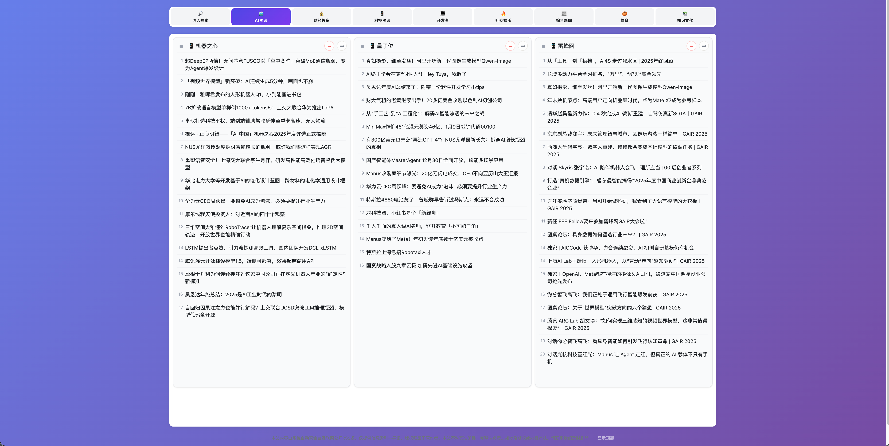

# Hotnews

 在线地址：https://hot.uihash.com



 
 面向“热点新闻 + RSS”聚合的轻量栈：
 
 - **Viewer（FastAPI）**：浏览器查看新闻、订阅 RSS
 - **Provider Ingestion**：抓取多平台热点，写入 `output/YYYY-MM-DD/news.db`
 - **RSS Warmup Scheduler**：后台抓取 RSS，写入 `output/online.db`
 - **MCP Server（可选）**：面向 AI 分析的 MCP 服务
 - **Playwright E2E**：Viewer 的端到端测试
 
 ---

 ## AI Assistants（多工具统一入口）

 - `docs/ai/AI_CONTEXT.md`
 - `docs/ai/AI_GUIDE.md`
 - `docs/README.md`
 - `openspec/AGENTS.md`

 入口文件（不同工具使用不同入口，但都指向同一套 canonical docs）：

 - Claude Code：`CLAUDE.md`
 - Windsurf：`WINDSURF.md`
 - VSCode Claude：`CURSOR.md`
 
 ## 快速开始（Docker，推荐）
 
 依赖：Docker。
 
 启动 Viewer 并在容器内执行一次抓取（生成当天数据）：
 
 ```bash
 bash docker/local-refresh-viewer.sh --ingest
 ```
 
 验证：
 
 - Health：`http://127.0.0.1:8090/health`
 - Viewer：`http://127.0.0.1:8090/`
 
 ---
 
 ## 本地运行（Python）
 
依赖：Python >= 3.10，`uv`。

```bash
bash setup-mac.sh
```


 抓取一次（写入 `output/YYYY-MM-DD/`）：
 
 ```bash
 uv run python -m hotnews
 ```
 
 启动 Viewer（本地脚本 `./start-viewer.sh`，默认端口 `8080`，访问 `/viewer`）：
 
 ```bash
 ./start-viewer.sh
 ```
 
 ---
 
 ## RSS 数据与统计
 
 RSS 数据在：`output/online.db`（表：`rss_sources` / `rss_entries`）。
 
 查询累计条数/覆盖源数：
 
 ```bash
 sqlite3 output/online.db "select count(*) as total, count(distinct source_id) as sources from rss_entries;"
 ```
 
 ---
 
 ## 前端构建（viewer.bundle.js）
 
 依赖：Node.js >= 18。
 
 ```bash
 npm install
 npm run build:js
 ```
 
 ---
 
 ## 测试（Playwright E2E）
 
 ```bash
 # 1) 确保 viewer 运行且有数据
 bash docker/local-refresh-viewer.sh --ingest
 
 # 2) 运行 E2E
 npm test
 ```
 
 ---
 
 ## MCP Server（可选）
 
 ```bash
 ./start-http.sh
 ```
 
 - HTTP endpoint：`http://127.0.0.1:3333/mcp`
 
 ---
 
 ## 部署
 
 参考：`openspec/specs/deployment.md`
 
 常用脚本：
 
 - `sync-to-server.sh`
 - `rsync-sync.sh`
 - `hotfix-viewer.sh`
 
 ---
 
 ## License
 
 GPL-3.0
 
 ---
